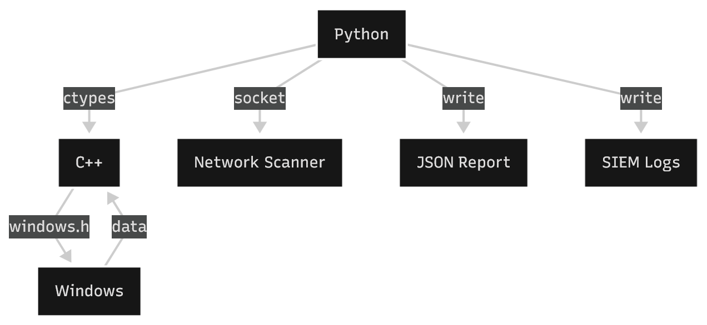
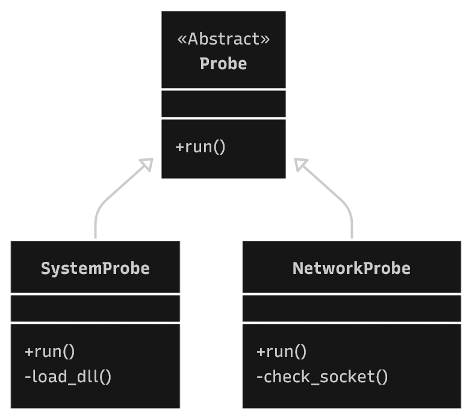

# Sys telemetry CLI 
A Python & C++ hybrid security tool for local system auditing and EDR telemetry simulation

## Table of content

<details>
<summary>Expand contents</summary>

- [Project goal](#project-goal)
- [Architecture](#architecture)
- [Code structure](#code-structure)
- [Results & output](#results--output)
- [How to run](#how-to-run)
</details>

## Project goal
This project explores cybersecurity centered programming and multi-language interaction capabilities by combining the ease of Python with the low-level access of C++

The goal is to simulate an EDR (endpoint detection and response) program

## Architecture
The tool uses a modular architecture where Python allocates memory buffers and passes pointers to the C++ binary for execution  

<p align="center"></p>  

### Why C++?
While Python can access system info, using C++ allows for:
* Stealth: Native windows.h calls are harder to spoof than high-level wrappers
* Performance: Direct memory manipulation via pointers
* Integration: Demonstrates how to handle buffers between high-level (Python) and low-level (C++) languages   

Using C++ also taught me how to interact with multiple languages in a single project

## Code structure
The project uses an object oriented design using an abstract base class to allow easy scalability (adding new probes)  

<p align="center"></p>  

## Results & output

### Terminal output
The CLI provides feedback on the scan status

```powershell
Starting Telemetry CLI
--------------------
System Report
User name: "***"
Computer name: "***"
Debugger active: False
System status: Safe
--------------------
Network Report
Number of scanned ports: 5
Open ports: ['None']
Closed ports: [21, 80, 443, 22, 3389]
Ports returning an error: ['None']
Network status: Safe
--------------------
Report saved to: c:\Users\[...]\output\report.json
Log sent to (SIEM simulation): c:\Users\[...]\logs\activity.log
```

### JSON report 
A structured file is generated for automated processing in the output folder (SIEM simulation)
```json
{
    "time": "2025-11-30T20:41:30.296270",
    "system_report": {
        "user": "***",
        "computer": "***",
        "is_debugger_active": false,
        "status": "Safe"
    },
    "network_report": {
        "scanned_ports_count": 5,
        "open": [
            "None"
        ],
        "closed": [
            21,
            80,
            443,
            22,
            3389
        ],
        "error": [
            "None"
        ],
        "status": "Safe"
    }
}
```

### Activity log
A new line is added to the activity log file in the logs folder

```yaml
[2025-11-30T20:41:30.296270] [Safe] Scan complete, ports open:ㅤ 0, debugger:ㅤ False
```

## How to run
The project is pre-compiled for Windows systems (telemetry.dll)

### Easy execution
Simply double-click the run.bat script at the root of the repository

### Manual execution

Clone the repository
```
git clone https://github.com/ahmedbda/sys-telemetry-cli.git
```

Navigate to source
```
cd sys-telemetry-cli
```

Run the main script
```
python src/python/main.py
```